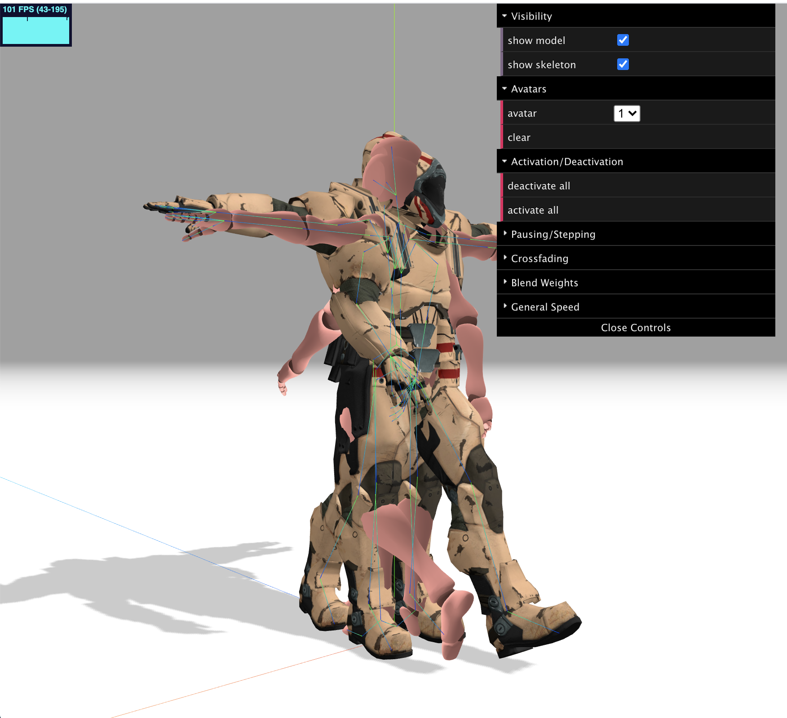

# depthmap-skeletal-analysis

## skeleton animation sandbox to interface with live 3D sensor.

## [live page](https://ronerlih.github.io/depthmap-skeletal-analysis/client/)

### Original rendering reference at: https://threejs.org/examples/?q=sk#webgl_animation_skinning_blending
